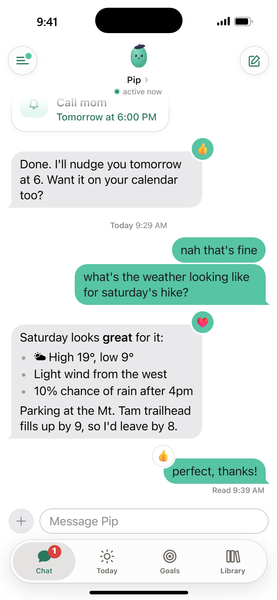
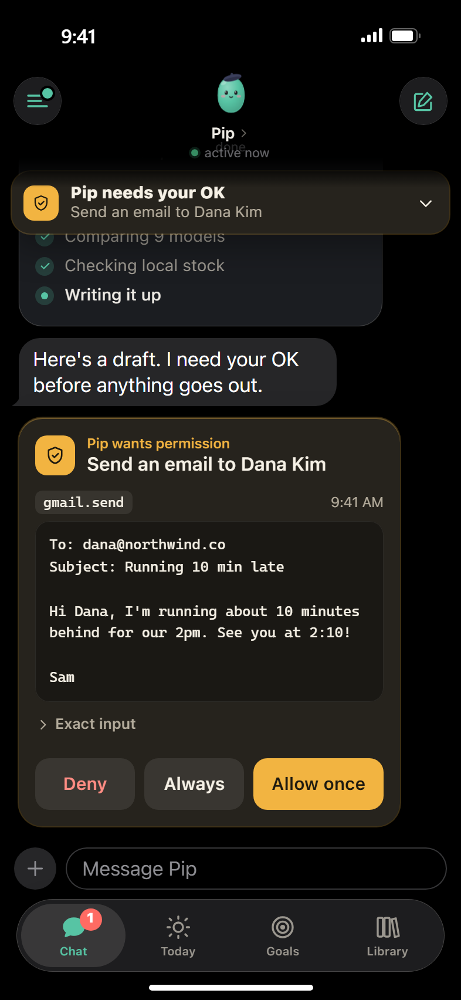
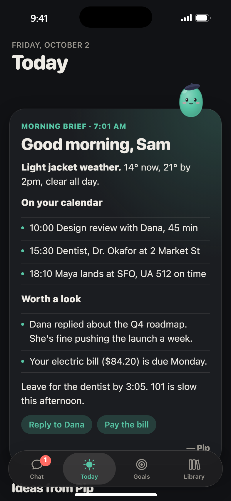
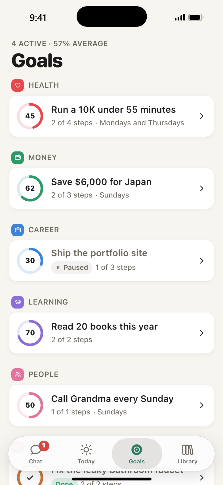
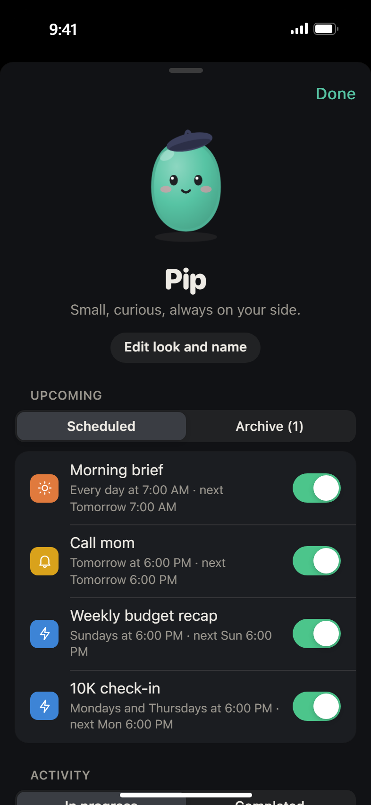

# Kin

Kin is a personal agent you host yourself. It runs on a machine you own, sends every model turn through the Claude Code CLI, and talks to you through a phone web app built like a messaging app. It has an animated avatar, read receipts, a typing indicator and tapback reactions that go both ways.

Every turn runs through your local `claude` login, so usage comes out of your Claude plan. There's no API key to manage.

<p align="center">
  
  
  
  
  
</p>

<p align="center"><sub>Screenshots from the built-in demo mode. Every person and message in them is made up.</sub></p>

## What it does

- Holds one long conversation that spans days. You can text it mid-task and it picks up the new message at its next tool call.
- Hands long jobs to background workers. They show up in the chat as live task cards.
- Sets reminders, runs scheduled tasks, writes a morning brief, checks in a few times a day and tracks goals.
- Keeps its memory in plain Markdown files. You can read and edit them from the app.
- Asks before anything that sends, buys, deletes or controls a device. You get an approval card and a push notification with Allow once, Always and Deny.
- Uses the Gmail, Google Calendar and Google Drive connectors from your claude.ai account. Home Assistant is optional.

## Requirements

- A Linux or macOS machine that stays on
- Node.js 22 or newer
- [Claude Code](https://docs.claude.com/en/docs/claude-code) installed and signed in with a Claude subscription (run `claude` once and log in)
- HTTPS in front of Kin. Phones only install web apps and deliver push notifications over HTTPS. Tailscale is the easiest way to get it.

## Quick start

```sh
git clone https://github.com/AverWasTaken/kin.git
cd kin
npm install
npm run web:install
npm run build:all
node dist/cli.js doctor   # checks the claude CLI, its login and its connectors
node dist/cli.js start
```

Kin listens on `127.0.0.1:3015`. `node dist/cli.js token` prints the token you sign in with.

### Add HTTPS

With Tailscale, only devices on your tailnet can reach it:

```sh
sudo tailscale serve --bg --https=8444 http://127.0.0.1:3015
```

Caddy or nginx work too. Think twice before putting Kin on the public internet. The agent has a full shell on the machine and the owner token is the only thing guarding it.

Set `KIN_VAPID_SUBJECT` to the URL you'll open Kin at, for example `https://myserver.my-tailnet.ts.net:8444`. Kin signs push notifications with it. Apple rejects subjects that point at localhost, and then nothing reaches your iPhone.

### Keep it running

```sh
npm install -g pm2
KIN_VAPID_SUBJECT=https://your-kin-url pm2 start ecosystem.config.cjs
pm2 save
```

### Set up your phone

Open your Kin URL, sign in with the token and go through setup. You'll name the agent, pick how it looks and tell it a bit about yourself.

On an iPhone, tap Share, then Add to Home Screen, and open Kin from the home screen icon. Turn on notifications from inside that installed app. iOS only delivers web push to apps added to the home screen.

## Connectors

Gmail, Google Calendar and Google Drive come from whichever claude.ai account the `claude` CLI is logged into. Add them at claude.ai under Settings, then Connectors. If Kin still can't see their tools, run `claude` on the server and authenticate each one with `/mcp`. You can also just ask Kin in the chat. It will send you the sign-in link.

To connect Home Assistant:

1. Enable the Model Context Protocol Server integration in Home Assistant.
2. Create a long-lived access token (your profile, then Security).
3. Run `node dist/cli.js secret ha <token> [http://127.0.0.1:8123]`.
4. Restart Kin.

## How it works

Each chat thread has one long-running `claude -p --input-format stream-json` process on Opus at medium effort. Receipts map to real events. "Delivered" means Kin wrote your message to the CLI's stdin. "Read" means Claude echoed it back through `--replay-user-messages`, so it's in the model's context. The process exits after 30 idle minutes and resumes the same session on your next message.

Background work runs on Sonnet at medium effort. That covers scheduled tasks, `start_task` hand-offs, the 7am morning brief, proactive check-ins, nightly memory consolidation and goal check-ins. A background run stays quiet unless it calls `send_message`. Reminders skip the model entirely and arrive as plain messages.

Permissions go through `--permission-prompt-tool mcp__kin__approve`. Bash, file edits, the web, Kin's own tools and read-only connector tools run without asking. Bash gets full access to the server, on purpose. Anything that sends, creates, deletes or controls something waits for your answer on an approval card.

The agent lives in `~/kin-home`:

| File | Contents |
|---|---|
| `soul.md` | personality and ground rules |
| `identity.md` | name and look, set during onboarding |
| `memory.md` | what it has learned about you |
| `notes/` | its working notes |
| `library/` | things it made for you, shown in the app |
| `tools/` | scripts it wrote for itself |
| `inbox/` | files and photos you sent it |

The agent edits these itself and keeps `memory.md` tidy with a nightly pass. You can edit any of them in the app.

Kin also runs an MCP server at `/mcp` with one bearer token per run. It gives the agent `send_message`, `react`, `set_status`, `schedule_reminder`, `schedule_task`, `list_schedules`, `cancel_schedule`, `start_task`, `goal_*`, `idea_add`, `feed_card`, `set_brief`, `library_save`, `notify` and `approve`.

### Source layout

| Path | What it does |
|---|---|
| `src/claude/session.ts` | the main chat process |
| `src/claude/runner.ts` | background runs |
| `src/claude/parse.ts` | stream-json parsing |
| `src/claude/config.ts` | CLI flags and permissions |
| `src/mcp.ts` | Kin's MCP tools |
| `src/approvals.ts` | the approval gate |
| `src/scheduler.ts` | cron, reminders and built-in jobs |
| `src/push.ts` | Web Push |
| `src/server.ts` | REST, WebSocket and the static PWA |
| `src/home.ts` | prompts and the agent's starter files |
| `src/shared/api.ts` | the API contract shared with the web app |
| `web/` | the PWA (see [web/README.md](web/README.md)) |

## Development

```sh
npm install && npm run web:install
npm test        # vitest, with tests/fake-claude.mjs standing in for the CLI
KIN_CLAUDE=tests/fake-claude.mjs KIN_DATA=.kin-dev/data KIN_HOME=.kin-dev/home npm run dev
npm run web:dev # Vite on :5173, proxies /api to :3015
```

Add `?mock=1` to the dev URL to run the web app against a simulated agent with no backend.

## Configuration

| Variable | Default | Meaning |
|---|---|---|
| `KIN_PORT` / `KIN_HOST` | `3015` / `127.0.0.1` | where the server listens |
| `KIN_DATA` | `~/.kin` | database, secrets and generated CLI config |
| `KIN_HOME` | `~/kin-home` | the agent's working directory and memory |
| `KIN_CLAUDE` | `claude` | path to the Claude Code CLI |
| `KIN_CHAT_MODEL` / `KIN_CHAT_EFFORT` | `opus` / `medium` | the foreground chat |
| `KIN_BG_MODEL` / `KIN_BG_EFFORT` | `sonnet` / `medium` | all background work |
| `KIN_MAX_BACKGROUND` | `2` | how many background runs at once |
| `KIN_IDLE_EXIT_MS` | `1800000` | idle time before the chat process exits |
| `KIN_VAPID_SUBJECT` | `https://kin.example.com` | push sender identity, set it to your Kin URL |
| `KIN_WEB_DIST` | `web/dist` | where the built web app lives |

## Deploying from another computer

`scripts/deploy.sh` builds the web app locally, copies the project to a server over ssh, builds it there and starts or reloads it under pm2:

```sh
KIN_DEPLOY_HOST=myserver bash scripts/deploy.sh   # installs to ~/kin on the server
```

Set `KIN_DEPLOY_DIR` to install somewhere else in your home directory.

## Security

Kin is built for one owner. Anyone with the owner token can talk to an agent that has a shell on your machine, so treat the token like an SSH key. Keep Kin on a private network like a tailnet unless you know what you're doing. The approval gate catches outgoing actions such as email, purchases and device control. It does not sandbox the shell.

## License

[MIT](LICENSE)
